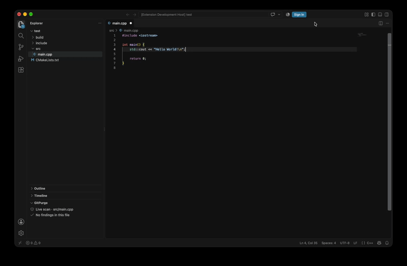

### 🛡️ Real-time secret detection for VS Code

GitPurge helps developers detect and intercept accidentally committed API keys, tokens, and secrets in real-time as you write.

[](https://marketplace.visualstudio.com)
[](https://opensource.org/licenses/Apache-2.0)
[](https://www.python.org/downloads/)

---




### ✨ Key Features

- **⚡ Real-Time Secret Detection**: Instantly catches leaked API keys, access tokens, and credentials in the editor before they ever touch git.
- **🧠 Shannon Entropy & Pattern Matching**: Employs mathematical entropy analysis alongside strict regular expressions to detect high-entropy secrets and minimize false positives.
- **🔒 100% Local & Private**: Scans execute completely on your machine—no code snippets, file names, or tokens are ever sent to remote servers.

---

## ⚡ Quickstart

### VS Code Extension

Install GitPurge from the **VS Code Extensions Marketplace**, or launch the command palette (`Ctrl+Shift+P` / `Cmd+Shift+P`) and use:

| Command | Action |
| :--- | :--- |
| `GitPurge: Scan Active File` | Scans the currently focused file for secrets |
| `GitPurge: Scan Workspace` | Runs a scan across all non-ignored project files |
| `GitPurge: Show Findings` | Opens a QuickPick list to jump directly to any detected secret |

#### Configuration

Add exclusions or adjust limits in your VS Code `settings.json`:

```json
{
  "gitpurge.exclude": [
    "**/.git/**",
    "**/node_modules/**",
    "**/.venv/**",
    "**/dist/**"
  ],
  "gitpurge.maxFileSize": 1048576
}
```

### Pre-commit Integration

Prevent secrets from reaching your Git history automatically by adding GitPurge to `.pre-commit-config.yaml`:

```yaml
repos:
  - repo: local
    hooks:
      - id: gitpurge
        name: GitPurge Secret Check
        entry: python3 -m gitpurge
        language: system
        pass_filenames: true
```

---

<details>
<summary><b>🛠️ Contributor & Development Guide</b></summary>
<br>

### Development Setup & Testing

#### Extension (TypeScript)
```sh
# Install dependencies
npm install

# Run test suite
npm test
```

#### Engine (Python >= 3.14)
```sh
# Install dependencies
uv sync          # or: pip install -e .

# Run test suite
pytest
```

### Repository Structure

```text
GitPurge/
├── src/
│   ├── extension.ts       # VS Code extension entry point & TreeDataProvider
│   ├── gitignore.ts       # .gitignore matching utility
│   ├── scanner.ts         # TypeScript secret scanner & entropy engine
│   └── gitpurge/          # Python engine
│       ├── detectors.py   # Regex secret rules & patterns
│       ├── entropy.py     # Shannon entropy analysis
│       ├── models.py      # Dataclasses (Finding, ScanResult, GitStatus)
│       ├── scanner.py     # Python core scanner orchestration
│       └── server.py      # Request handler and CLI entry point
├── test/                  # Test suites and fixtures
├── package.json           # Extension manifest & scripts
├── pyproject.toml         # Python project configuration
└── tsconfig.json          # TypeScript compiler configuration
```

</details>

---

## 🔒 Privacy & Local Execution

GitPurge processes all code 100% locally. No code snippets, file names, tokens, or diagnostics are ever transmitted to external APIs or remote tracking services.
